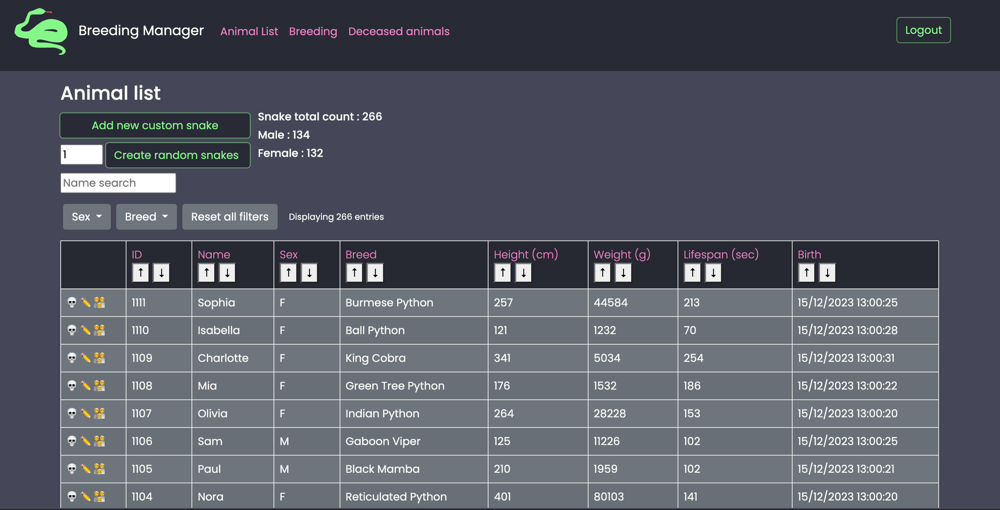

# Animal Breeding Manager

  
  

## Overview

This is a web application to manage an Animal Breeding. It helps you keep you track of the animals along with their data.

Features include :

- Data for each animal
- Name
- Breed
- Height
- Weight
- Lifespan
- Birth date
- Death date
- Father
- Mother



## Run the app

This web application uses PHP and has to be run on a PHP server.

## Databse

A MySQL/MariaDB server is required to host the database.

### Set up the database

Run the SQL script `createDB_breedingManager.sql` through your PHPMyAdmin interface or with other means.

### Enter your credentials

Your login information to the database can be filled in the `__construct` function in `bdd.class.php` where:

- `$h` is the domain name
- `$db` is the name of your database
- `$u` is the username
- `$pw` is the password

```php
public function __construct($h='localhost', $db='breedingManager', $u='user_name', $pw='password')
```
